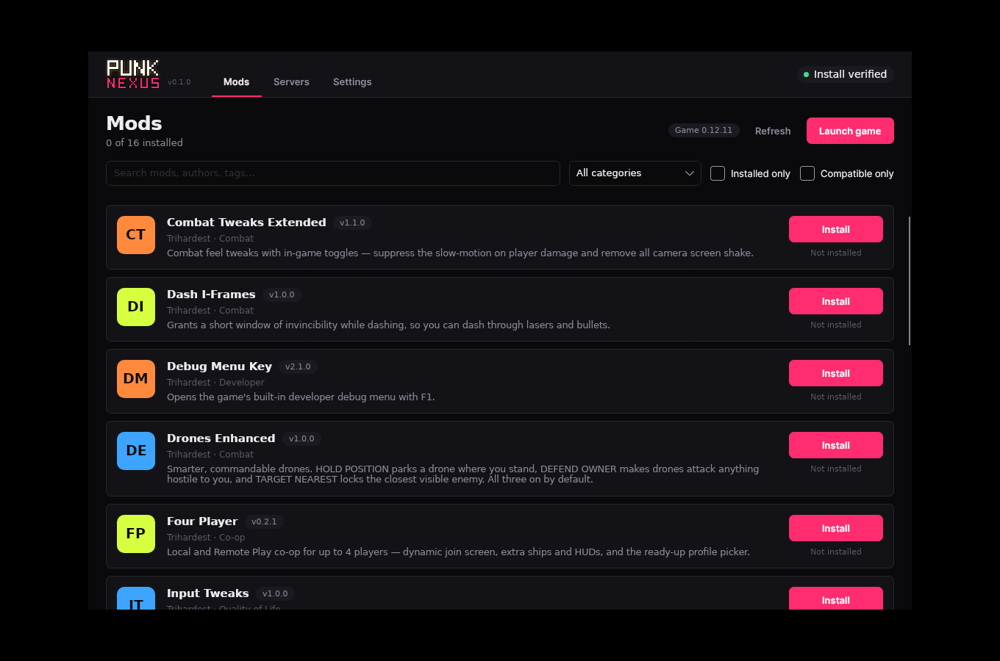
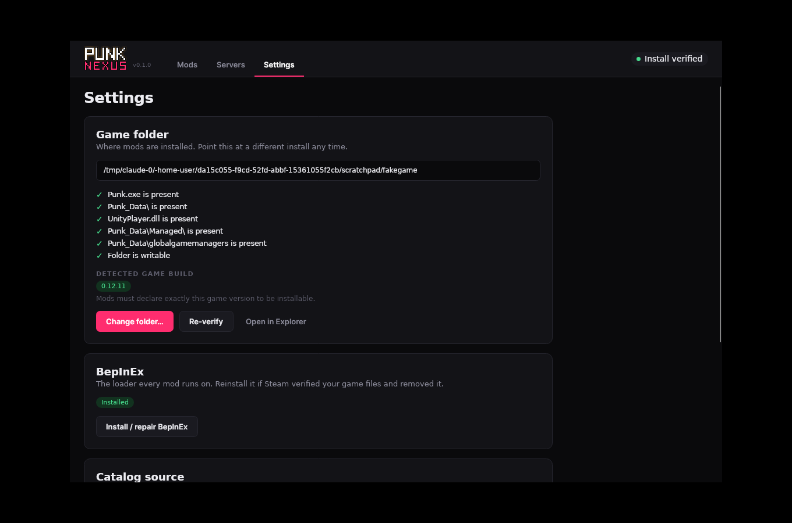
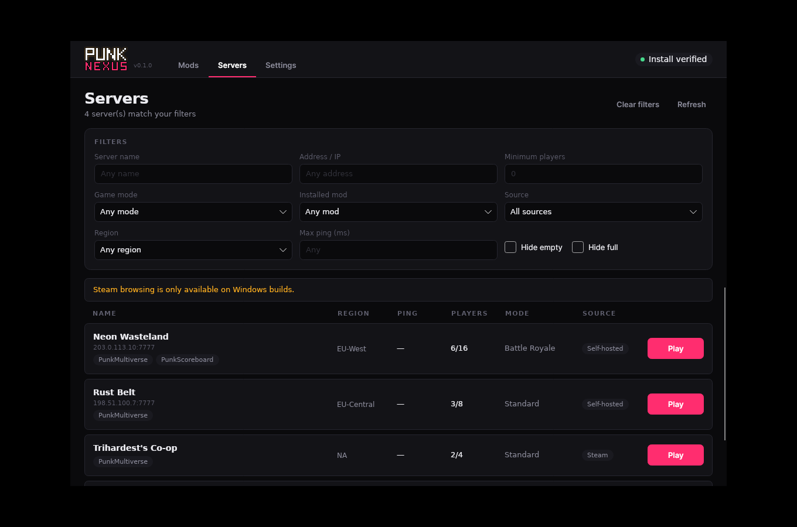

# PUNK Nexus

A mod browser, installer and server browser for **PUNK** (Steam Playtest). One Windows executable —
no runtime to install, no launcher account, nothing running in the background.

It finds your game, installs BepInEx, installs and removes mods, and lists the multiplayer sessions
you can actually join. When you pick a server it makes your install match that server's mods,
launches the game, and joins for you — then puts your own mods back when you're done.



---

## Install

1. Download `PunkNexus.exe` from the [latest release](https://github.com/Osanchez/PunkNexus/releases/latest).
2. Run it. It is a single self-contained file — put it wherever you like.
3. Accept the risk notice, confirm the game folder it found, and you're in.

There is no installer. Settings, logs and caches live in `%LOCALAPPDATA%\PunkNexus\`, mods go in the
game folder you point it at, and the only other thing written anywhere is the update: it stages the
new build beside the running exe (`PunkNexus.update.exe`, and the old build as `PunkNexus.exe.old`)
because that is the only place a program can replace itself from.

---

## What it does

### Finds your game, and proves it

Setup searches the Steam library folders from the registry and `libraryfolders.vdf`, plus the usual
install locations. If that fails you pick the folder yourself, and either way it **shows you what it
checked** rather than just claiming success — `Punk.exe`, `Punk_Data\`, `UnityPlayer.dll`, the
managed assemblies, and whether the folder is actually writable.

It also reads the game's real version out of `Punk_Data\globalgamemanagers`, which is what every
compatibility decision below is made against.



If the install later disappears — a Steam verify, an uninstall, an unplugged drive — the client
notices within seconds and drops back to setup instead of failing halfway through an install.

### Installs mods, and BepInEx

BepInEx is the loader everything else runs on; the Mods tab installs it in one click if it's
missing. After that every mod is one button.

Its download is **pinned to one release asset, with a checksum**, and updated by hand. That is
deliberate: BepInEx is tied to the game's engine version and is what every mod here is compiled
against, so following upstream automatically would be a downgrade in safety rather than an upgrade.
It is not expected to change often, if at all.

Downloads are checked **before** anything is written:

- **sha256**, when the mod publishes one. A mismatch **stops the install** — the dialog explains
  what was found and offers only Close. Publishing a checksum is a promise about exactly which
  bytes were released, so a file that fails it is not the released file. Publishing none is no
  promise, and is only reported.
- **The manifest inside the archive** — the packaged `mod.json` must claim the same mod id as the
  one you asked for, so a mislabelled or swapped archive is caught before extraction.
- **Every archive entry**, against paths that escape the game folder.

You're shown exactly what was verified, and an unverifiable download says so plainly rather than
pretending.

Uninstalling removes the files the client recorded writing, so it takes out what it put in.

### Shows what a virus scan found — and what it doesn't mean

Every download in the catalog is scanned with VirusTotal on a schedule. Select a mod to see its
latest report: which file was scanned, when, by how many engines, and a link to the full report on
VirusTotal. At install time you're told whether the scan covers the *exact* file you just
downloaded, matched by hash, or whether it covers an earlier build.

Two things this deliberately does not do:

- **It doesn't gate anything.** A failed checksum stops an install outright, because it is a
  broken promise about which bytes were released. A scan result carries no such certainty, so it
  never changes the verdict or the buttons — it is one more line of evidence.
- **It doesn't put a detection count in front of you as a verdict.** Mods are unsigned code whose
  job is patching a running game — precisely what heuristic antivirus engines look for — so a
  legitimate mod picking up a couple of detections is ordinary. Counts appear in the report, next to
  the explanation, never as a badge on a list.

A mod with no report yet is normal, and says nothing about it either way. See
[docs/VIRUS_SCANNING.md](docs/VIRUS_SCANNING.md) for the schema and the rules the UI follows.

### Browses servers



Sessions come from two places and merge into one list:

- **Steam sessions** — read live from Valve's lobby list. A Steam lobby is destroyed when its last
  member leaves, so the list cannot go stale; there is no heartbeat and no cache to be wrong.
- **Self-hosted (UDP) servers** — from the published list. Specified but not built yet; see
  [`docs/SERVER_LIST.md`](docs/SERVER_LIST.md).

Filter by name, address, players, game mode, installed mod, region, source, and max ping.

**Ping is estimated without sending a single packet to any host.** Steam's relay hides host
addresses on purpose, so there is nothing to ping — instead the host publishes an opaque network
location and the client compares it to its own locally. Nothing here contacts a game server just to
draw a list.

### Play: joins a server without losing your mods

PunkMultiverse compares a joiner's **entire** BepInEx plugin set against the host's and, by default,
refuses any difference. So joining a server does not mean "add its mods" — it means "make my plugin
folder equal the server's". That is destructive by nature.

The client's rule is that **nothing is ever deleted to make room.** Anything in the way is *moved*
to `BepInEx\nexus-shelf\` and moved back afterwards, byte for byte — because a mod you installed by
hand has no download to repeat, and a mod's tuned settings often live inside its own plugin folder.

You see exactly what will change before anything moves, and your own mods come back on their own:
when the game exits, and — if the client was closed or crashed mid-session — when it next starts.
There is no button to press and no banner telling you a visit is in progress; a server visit is
meant to be invisible, and something you have to undo by hand is not.

---

## Game-version compatibility

A mod declares the game version it was built against, and the client compares that for **exact
equality** against the version detected in your install. What it does with the answer is **tell
you, and let you decide**:

| Situation | Result |
|---|---|
| Mod declares your exact game version | Installable, no warning |
| Mod declares a different version | Installable, warned — "Built for game X, but yours is Y" |
| Mod declares nothing | Installable, warned — it does not say what it was built for |
| Client cannot read your game version | Installable, warned — the detection failed, not the mod |

This used to be a refusal, and it was wrong. The game moving from 0.12.10 to 0.12.11 made **every
one of the sixteen listed mods uninstallable overnight**, most of which were unaffected by the
change — a compatibility rule strict enough to be useless. A version mismatch is a good reason to
warn somebody and a bad reason to stop them, so it warns.

The two things that *do* stop an install are different in kind: a download whose published
checksum does not match, and an archive whose contents are not the mod you asked for. Those are
statements about whether the bytes are what they claim to be, not guesses about whether they will
work.

---

# For mod developers

Getting listed takes one pull request. After that you never touch this repo again — releasing a new
version is a change in **your** repo.

## How the catalog is built

Three tiers, and the split is the whole point:

| Tier | Lives in | Owns |
|---|---|---|
| **Registry** — `manifest/mods.json` | this repo | Identity and presentation. A pointer to your manifest. **Never a version.** |
| **Mod manifest** — `mod.json` | *your* repo | Version, game version, download location. The source of truth. |
| **Installed manifest** — the same `mod.json` | inside your zip | What the client reads back to know what is installed. |

Because the registry holds no version, **it cannot go stale.** You bump your own `mod.json` when you
release and the client picks it up on its next refresh — no pull request, no waiting on a review.

## 1. Add `mod.json` to your repo

At a stable path — the registry will point a raw URL at it.

```jsonc
{
  "schemaVersion": 1,

  "id": "MyCoolMod",                    // unique, stable, never changes. Matches the registry.
  "name": "My Cool Mod",                // shown in the client
  "author": "YourName",
  "version": "1.2.0",                   // THE version. Bump on every release.
  "gameVersion": "0.12.11",             // the game build you tested against — exact match
  "description": "One sentence on what it does.",
  "category": "Combat",                 // free text; groups the category filter
  "iconUrl": null,                      // https URL to a small square PNG, or null
  "homepage": "https://github.com/you/MyCoolMod",
  "tags": ["combat", "qol"],

  "pluginFolder": "MyCoolMod",          // folder under BepInEx/plugins. Defaults to id.
  "dependencies": [],                   // other registry ids that must be installed too

  "download": {
    "repo": "you/MyCoolMod",            // GitHub owner/name...
    "assetPattern": "MyCoolMod-v*.zip"  // ...and a glob matched on the latest release's assets
  },

  "sha256": null                        // optional, strongly encouraged — see below
}
```

### Hosting the download somewhere other than GitHub

The `download` block takes either form. Use a fixed URL when you host it yourself:

```jsonc
"download": { "url": "https://mods.example.com/mycoolmod-1.2.0.zip" }
```

It must be **https**. The `repo` + `assetPattern` form exists because release zips usually carry
their version in the filename, and a fixed URL would 404 on your next release.

### About `sha256`

Optional, and worth doing. When present the client verifies the downloaded bytes and **refuses to
install on a mismatch**.

The catch: it must match the exact file that URL serves *right now*. So a hash and a **moving**
download pointer cannot both be correct — if `assetPattern` resolves to your latest release and your
pipeline rebuilds the zip, the hash is wrong the moment you push, and a mismatch **blocks the
install**. A stale hash is strictly worse than no hash: it turns a working mod into an uninstallable
one.

Two honest options:

- **Pin and hash together, as a post-build step.** Hashing has to happen *after* the artifact
  exists, so make it part of your release pipeline: build, publish, then write the asset's URL and
  its `sha256` into your `mod.json` and commit that. Both move together, so they never disagree.
  This is what [PunkMods](https://github.com/Osanchez/PunkMods) does — see `tools/pin-downloads.py`
  and the `Pin downloads and checksums` step in its release workflow, including the `[skip ci]`
  marker that stops the commit re-triggering the build.

  While a build runs, the manifest still names the *previous* release and its hash — an asset
  GitHub keeps forever — so the catalog is never inconsistent, only one job behind.

- **Neither.** Keep `repo` + `assetPattern` for auto-latest and leave `sha256` as `null`. The client
  says plainly that the download was not verified beyond the transport.

Don't mix them: `assetPattern` plus a hash is a contradiction, because the pointer is allowed to
move to a build the hash does not describe.

## 2. Ship `mod.json` inside your zip

The same file, at the root of your plugin folder:

```
MyCoolMod-v1.2.0.zip
└── BepInEx/
    └── plugins/
        └── MyCoolMod/
            ├── MyCoolMod.dll
            └── mod.json          ← the same manifest
```

The archive must extract from the **game folder root** — that is, it contains `BepInEx/...`. That
installed copy is how the client knows what version you have, so a zip without it is a mod that can
be installed but never recognised as up to date. (The client will write one from the published
manifest as a fallback, and log a warning — don't rely on it.)

The two copies must agree on `id` and `version`; that is what the client checks. They need not be
identical otherwise — if you fill in `sha256` after building (see below), the published copy will
carry a hash the packaged one cannot, since it is a hash *of* the packaged one.

## 3. Open a pull request adding your registry entry

Add one object to the `mods` array in [`manifest/mods.json`](manifest/mods.json):

```jsonc
{
  "id": "MyCoolMod",
  "manifestUrl": "https://raw.githubusercontent.com/you/MyCoolMod/main/mod.json",

  "name": "My Cool Mod",
  "author": "YourName",
  "category": "Combat",
  "description": "One sentence on what it does.",
  "iconUrl": null,
  "homepage": "https://github.com/you/MyCoolMod",
  "tags": ["combat", "qol"],
  "enabled": true,

  "bepInExGuid": "com.you.mycoolmod",   // optional; lets servers naming plugins by GUID resolve
  "pluginFolder": "MyCoolMod"           // optional; only if it differs from the id
}
```

Note what is **not** here: no version, no game version, no download URL. Those live in your
`mod.json`, which is what keeps the registry from going stale.

`enabled: false` delists a mod without deleting its history.

### What CI checks on your pull request

[`tools/validate-manifest.py`](tools/validate-manifest.py) runs automatically and fails the PR on:

- The registry not being valid JSON, or an entry with no `id`.
- A `manifestUrl` that does not fetch, or does not return valid JSON.
- Your `mod.json` declaring a different `id` than the registry entry.
- A missing `version` — the client reads it to detect updates.
- A missing `gameVersion` — the client refuses to install a mod that doesn't declare one.
- A `download` block that is absent, malformed, non-https, or has neither a `url` nor both
  `repo` and `assetPattern`.

Your `gameVersion` differing from the registry's `targetGameVersion` is **not** an error — the
catalog is allowed to target a newer build than you have caught up with. Your mod is simply listed
as needing a different version until you update it.

## Releasing an update

1. Bump `version` in your `mod.json` (and `gameVersion` if you retested against a new build).
2. Publish a release whose asset matches your `assetPattern`, with the updated `mod.json` inside.

That's it. The client compares the installed `mod.json` against the published one and offers the
update. **No pull request against this repo.**

## Checklist

- [ ] `mod.json` at a stable raw URL in your repo
- [ ] Same `mod.json` inside the zip, at `BepInEx/plugins/<pluginFolder>/mod.json`
- [ ] Zip extracts from the game root (contains `BepInEx/...`)
- [ ] `id` identical in both files and in the registry entry
- [ ] `gameVersion` is the build you actually tested
- [ ] `download` resolves to a real asset over https
- [ ] Registry entry added to `manifest/mods.json`, PR opened, CI green

The full contract, with more detail on each field, is in
[`docs/MOD_AUTHORING.md`](docs/MOD_AUTHORING.md).

---

## Build from source

```bash
dotnet build src/PunkNexus/PunkNexus.csproj

dotnet publish src/PunkNexus/PunkNexus.csproj -c Release -r win-x64 --self-contained true \
  -p:PublishSingleFile=true -p:IncludeNativeLibrariesForSelfExtract=true -o publish
```

**Every push builds the Windows exe** ([`.github/workflows/build.yml`](.github/workflows/build.yml)).
Branch pushes leave it as a downloadable workflow artifact; pushes to `main` also publish a Release
tagged `vYYYY.MM.DD.<run-number>`.

Built on [Avalonia](https://avaloniaui.net/) targeting `net8.0`, which keeps the project compiling
and runnable on Linux CI and dev machines while still shipping a native Windows executable. Trimming
is deliberately off — Avalonia resolves XAML types by name at runtime and a trimmed build dies on
first navigation.

Steam browsing binds to Steamworks.NET, which ships managed bindings only. The native
`steam_api64.dll` is **not** redistributed here — the client loads the one already in your verified
game folder.

## Layout

| Path | Contents |
|---|---|
| `src/PunkNexus/Models/` | Manifest and local-state DTOs |
| `src/PunkNexus/Services/` | Install detection, download, extraction, manifests, Steam, launching |
| `src/PunkNexus/ViewModels/` | One per screen, plus the shared `GameSession` |
| `src/PunkNexus/Views/` | Avalonia XAML |
| `src/PunkNexus/Themes/` | The PUNK theme — colors and control styles |
| `manifest/` | The published mod and server catalogs |
| `reports/` | **Generated** — VirusTotal scan reports, written by CI. Do not edit |
| `tools/` | `validate-manifest.py` (catalog checker) and `virus-scan.py` (scanner), both run by CI |
| `docs/` | [Mod authoring contract](docs/MOD_AUTHORING.md), [server list design](docs/SERVER_LIST.md), [virus scanning](docs/VIRUS_SCANNING.md) |

## Where it keeps things

`%LOCALAPPDATA%\PunkNexus\` holds `settings.json`, the cached catalog, downloaded icons, the
per-install file records under `installs\`, and `punknexus.log`. Nothing in there affects the game;
deleting it resets the client to a first run. **Settings → Maintenance** opens it.

One folder does live in the game install: `BepInEx\nexus-shelf\`, where your mods are parked during
a server visit. It has to be on the same volume as `BepInEx\plugins` for the move to be instant and
atomic. It sits *beside* `plugins`, never inside, so BepInEx never loads what is parked there, and
it is removed once empty.

## Safety notes

- Archives are validated entry by entry before a single byte is written, so an entry pointing
  outside the game folder is rejected rather than followed.
- The client refuses to install or remove while `Punk.exe` is running, since the game holds its
  DLLs open.
- It never elevates itself. If the game folder is not writable it says so and asks you to relaunch
  as administrator.
- `sha256` is honoured for any manifest entry that sets it; entries without one are not verified
  beyond the transport.
- Catalog downloads are scanned with VirusTotal and the result is shown before you install, matched
  to the file by hash. It is evidence, not a gate — see
  [docs/VIRUS_SCANNING.md](docs/VIRUS_SCANNING.md) for why, and for why a couple of detections on a
  legitimate mod is expected rather than alarming.
- Mods are third-party code that you choose to install. This client downloads and extracts what the
  catalog points at — a scan is not a review, and neither is this client.
